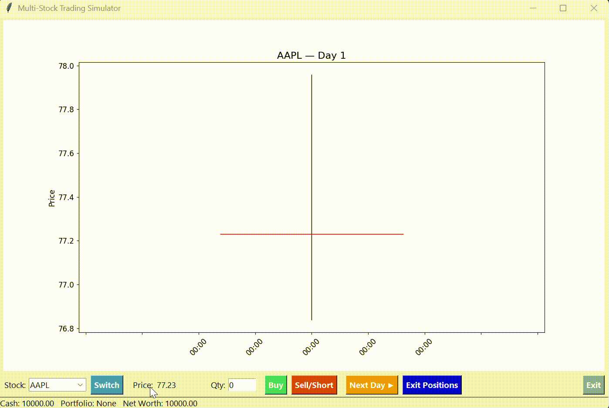

# Multi-Stock Trading Simulator

A GUI-based stock trading game with simulated candlestick charts, buy/sell/short orders, portfolio tracking, and instant exit from all positions.

## Project Structure
```
stock-trading-simulator/
├── README.md           # this file, including structure
├── LICENSE             # MIT license
├── requirements.txt    # Python dependencies
├── src/                # application code
    ├── simulation.py   # StockSimulator back-end logic
    ├── gui.py          # TradingApp front-end UI
    └── main.py         # entry-point
```

## Setup
```bash
pip install -r requirements.txt
```

## Run
```bash
python -m src.main
```

## 📽️ Demo



# License

MIT License (see [LICENSE](LICENSE))